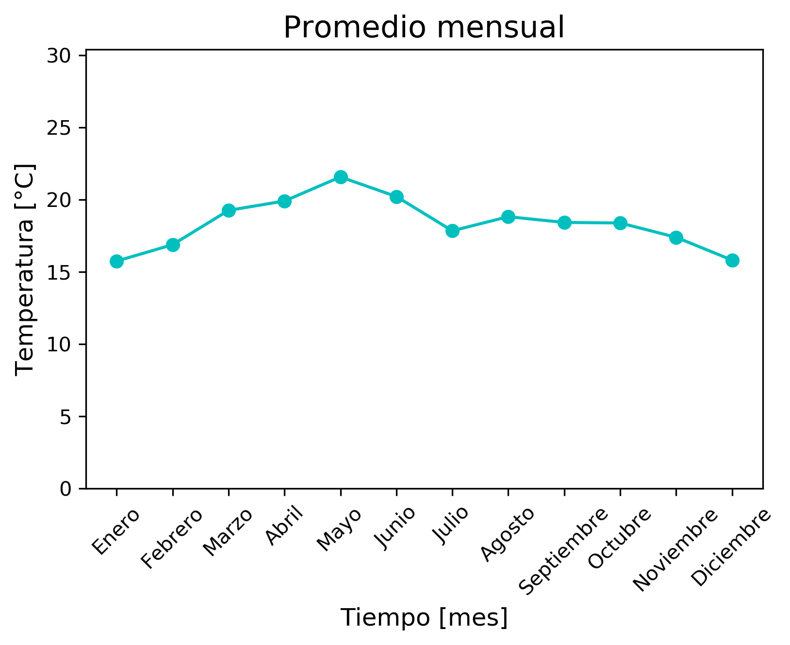
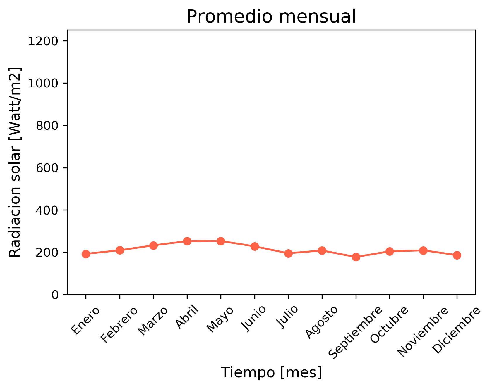
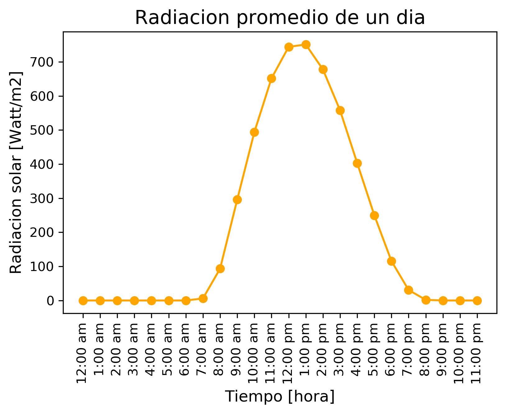
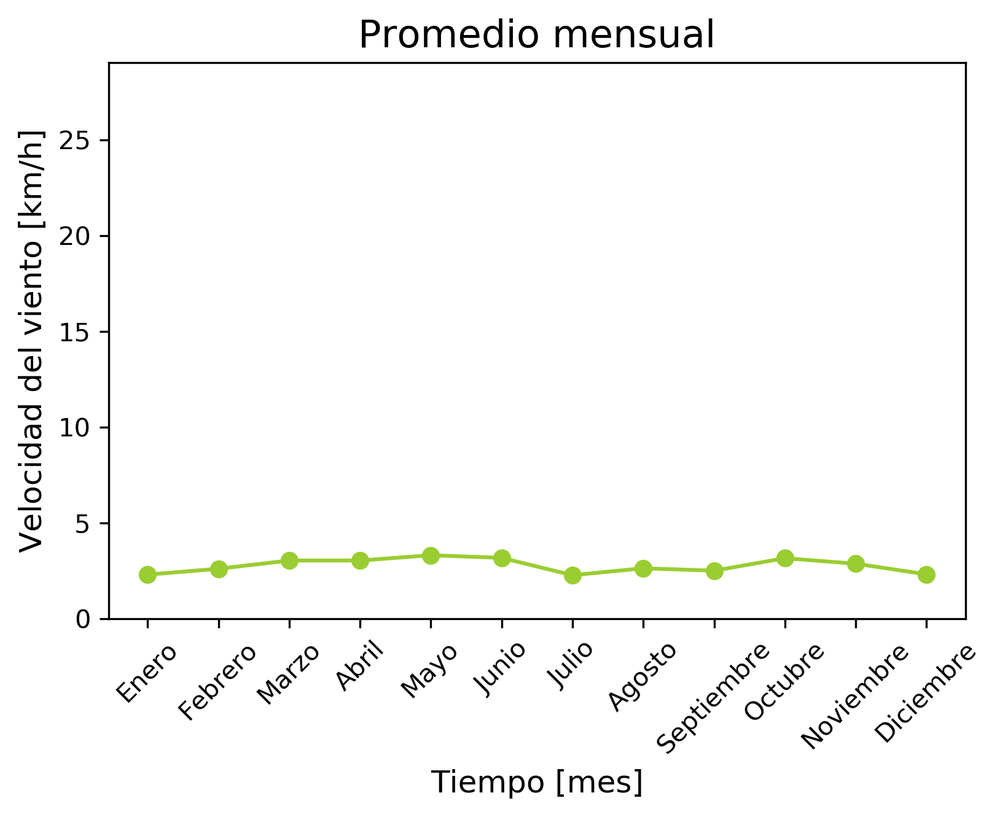
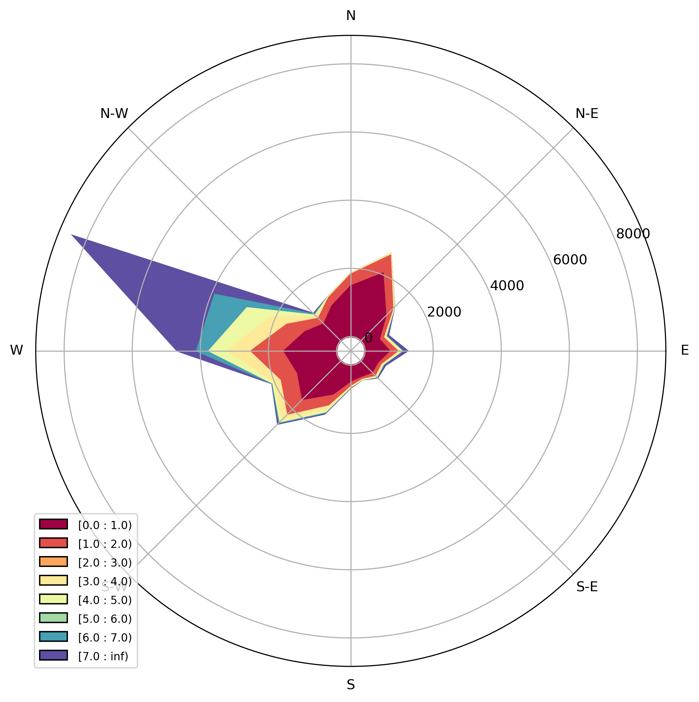

# Valle_de_Bravo
# _Algunas características meteorológicas de Valle de Bravo_  
  
El Instituto de Ciencias del Mar y Limnología cuenta con una estación meteorológica localizada al este del lago, que mide diversos parámetros cada 15 minutos.  
Se analizaron algunos parámetros con ayuda de una base de datos generada por la estación para el año 2017,  obteniendo el promedios de los parámetros correspondientes a cada mes del año.

  
## Temperatura  
El periodo con temperaturas más bajas corresponde al periodo de mezcla (invierno), ya que el lago está clasificado como monomíctico cálido.
* T promedio = 18 ° C
* T máxima = 30 ° C (mayo)
* T mínima = 7 ° C (diciembre)

## Radiación solar
Hay dos máximos de radiación: abril y noviembre.  
El periodo con menor incidencia de radiación concide con la temporada de lluvias (julio - septiembre), esto puede deberse a que el aumento de nubosidad impide la incidencia de radiación.

## Comportamiento de la radiación durante un día
Las horas de luz son entre las 7 am y las 6 pm, teniendo días de 11 h y noches de 13 h.  
La máxima incidencia de radiación ocurre entre las 12 - 1 pm, donde probablemente también suceda la máxima actividad fotosintética.

## Velocidad del viento
La velocidad del viento más frecuente es de 5 km/h, siendo mayo el mes con viento más fuerte (hasta 20 km/h).  
De nuevo, se observa una correspondencia entre el periodo húmedo (julio - septiembre) y una disminución de la intensidad del viento.

## Rosa de vientos
El viento proviene generalmente del oeste-noroeste de donde también llegan los vientos más intensos (7-20 km/h).
